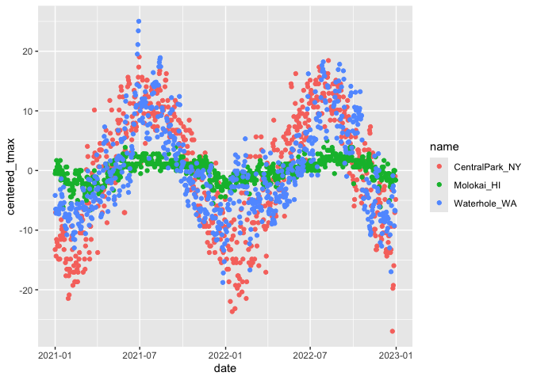

exploritory analysis
================
linshan
2024-09-26

``` r
library(tidyverse)
```

    ## ── Attaching core tidyverse packages ──────────────────────── tidyverse 2.0.0 ──
    ## ✔ dplyr     1.1.4     ✔ readr     2.1.5
    ## ✔ forcats   1.0.0     ✔ stringr   1.5.1
    ## ✔ ggplot2   3.5.1     ✔ tibble    3.2.1
    ## ✔ lubridate 1.9.3     ✔ tidyr     1.3.1
    ## ✔ purrr     1.0.2     
    ## ── Conflicts ────────────────────────────────────────── tidyverse_conflicts() ──
    ## ✖ dplyr::filter() masks stats::filter()
    ## ✖ dplyr::lag()    masks stats::lag()
    ## ℹ Use the conflicted package (<http://conflicted.r-lib.org/>) to force all conflicts to become errors

## Load the data

``` r
weather_df = 
  rnoaa::meteo_pull_monitors(
    c("USW00094728", "USW00022534", "USS0023B17S"),
    var = c("PRCP", "TMIN", "TMAX"), 
    date_min = "2021-01-01",
    date_max = "2022-12-31") |>
  mutate(
    name = case_match(
      id, 
      "USW00094728" ~ "CentralPark_NY", 
      "USW00022534" ~ "Molokai_HI",
      "USS0023B17S" ~ "Waterhole_WA"),
    tmin = tmin / 10,
    tmax = tmax / 10,
    month = lubridate::floor_date(date, unit = "month")) |>
  select(name, id, everything())
```

    ## using cached file: /Users/linshanxie/Library/Caches/org.R-project.R/R/rnoaa/noaa_ghcnd/USW00094728.dly

    ## date created (size, mb): 2024-09-26 11:21:54.721264 (8.651)

    ## file min/max dates: 1869-01-01 / 2024-09-30

    ## using cached file: /Users/linshanxie/Library/Caches/org.R-project.R/R/rnoaa/noaa_ghcnd/USW00022534.dly

    ## date created (size, mb): 2024-09-26 11:22:00.710929 (3.932)

    ## file min/max dates: 1949-10-01 / 2024-09-30

    ## using cached file: /Users/linshanxie/Library/Caches/org.R-project.R/R/rnoaa/noaa_ghcnd/USS0023B17S.dly

    ## date created (size, mb): 2024-09-26 11:22:02.515276 (1.036)

    ## file min/max dates: 1999-09-01 / 2024-09-30

## Setting options

``` r
#一般画图的操作：预先设定好自己喜欢的theme和color
library(tidyverse)

knitr::opts_chunk$set(
  fig.width = 6,
  fig.asp = .6,
  out.width = "90%"
)

theme_set(theme_minimal()+theme(legend.position = "bottom"))

options(
  ggplot2.continuous.colour = "viridis",
  ggplot2.continuous.fill = "viridis")

scale_colour_discrete = scale_colour_viridis_d
scale_fill_discrete = scale_fill_viridis_d
```

Let us make some plots

``` r
weather_df |> 
  ggplot(aes(x = prcp)) + 
  geom_histogram()
```

    ## `stat_bin()` using `bins = 30`. Pick better value with `binwidth`.

    ## Warning: Removed 15 rows containing non-finite outside the scale range
    ## (`stat_bin()`).

<!-- -->
发现大部分降水集中在0附近以及500一下，但有一些很大的，接下来，看看都是什么

``` r
weather_df |> 
  filter(prcp >= 1000)
```

    ## # A tibble: 3 × 7
    ##   name           id          date        prcp  tmax  tmin month     
    ##   <chr>          <chr>       <date>     <dbl> <dbl> <dbl> <date>    
    ## 1 CentralPark_NY USW00094728 2021-08-21  1130  27.8  22.8 2021-08-01
    ## 2 CentralPark_NY USW00094728 2021-09-01  1811  25.6  17.2 2021-09-01
    ## 3 Molokai_HI     USW00022534 2022-12-18  1120  23.3  18.9 2022-12-01

``` r
weather_df |> 
  filter(tmax >= 20, tmax <= 30) |> 
  ggplot(aes(x = tmin, y = tmax, color = name, shape = name)) + 
  geom_point(alpha = .75)
```

<!-- -->

## group_by

``` r
weather_df |>
  group_by(name, month)
```

    ## # A tibble: 2,190 × 7
    ## # Groups:   name, month [72]
    ##    name           id          date        prcp  tmax  tmin month     
    ##    <chr>          <chr>       <date>     <dbl> <dbl> <dbl> <date>    
    ##  1 CentralPark_NY USW00094728 2021-01-01   157   4.4   0.6 2021-01-01
    ##  2 CentralPark_NY USW00094728 2021-01-02    13  10.6   2.2 2021-01-01
    ##  3 CentralPark_NY USW00094728 2021-01-03    56   3.3   1.1 2021-01-01
    ##  4 CentralPark_NY USW00094728 2021-01-04     5   6.1   1.7 2021-01-01
    ##  5 CentralPark_NY USW00094728 2021-01-05     0   5.6   2.2 2021-01-01
    ##  6 CentralPark_NY USW00094728 2021-01-06     0   5     1.1 2021-01-01
    ##  7 CentralPark_NY USW00094728 2021-01-07     0   5    -1   2021-01-01
    ##  8 CentralPark_NY USW00094728 2021-01-08     0   2.8  -2.7 2021-01-01
    ##  9 CentralPark_NY USW00094728 2021-01-09     0   2.8  -4.3 2021-01-01
    ## 10 CentralPark_NY USW00094728 2021-01-10     0   5    -1.6 2021-01-01
    ## # ℹ 2,180 more rows

``` r
#一共3个name，24个month 所以groupby（name，month）有72组
```

counting stuff

``` r
weather_df |>
  group_by(month) |>
  summarize(n_obs = n())
```

    ## # A tibble: 24 × 2
    ##    month      n_obs
    ##    <date>     <int>
    ##  1 2021-01-01    93
    ##  2 2021-02-01    84
    ##  3 2021-03-01    93
    ##  4 2021-04-01    90
    ##  5 2021-05-01    93
    ##  6 2021-06-01    90
    ##  7 2021-07-01    93
    ##  8 2021-08-01    93
    ##  9 2021-09-01    90
    ## 10 2021-10-01    93
    ## # ℹ 14 more rows

``` r
weather_df |>
  group_by(name, month) |>
  summarize(n_obs = n())
```

    ## `summarise()` has grouped output by 'name'. You can override using the
    ## `.groups` argument.

    ## # A tibble: 72 × 3
    ## # Groups:   name [3]
    ##    name           month      n_obs
    ##    <chr>          <date>     <int>
    ##  1 CentralPark_NY 2021-01-01    31
    ##  2 CentralPark_NY 2021-02-01    28
    ##  3 CentralPark_NY 2021-03-01    31
    ##  4 CentralPark_NY 2021-04-01    30
    ##  5 CentralPark_NY 2021-05-01    31
    ##  6 CentralPark_NY 2021-06-01    30
    ##  7 CentralPark_NY 2021-07-01    31
    ##  8 CentralPark_NY 2021-08-01    31
    ##  9 CentralPark_NY 2021-09-01    30
    ## 10 CentralPark_NY 2021-10-01    31
    ## # ℹ 62 more rows

``` r
weather_df |>
  count(name)
```

    ## # A tibble: 3 × 2
    ##   name               n
    ##   <chr>          <int>
    ## 1 CentralPark_NY   730
    ## 2 Molokai_HI       730
    ## 3 Waterhole_WA     730

``` r
weather_df |>
  pull(month) |> 
  table()
```

    ## 
    ## 2021-01-01 2021-02-01 2021-03-01 2021-04-01 2021-05-01 2021-06-01 2021-07-01 
    ##         93         84         93         90         93         90         93 
    ## 2021-08-01 2021-09-01 2021-10-01 2021-11-01 2021-12-01 2022-01-01 2022-02-01 
    ##         93         90         93         90         93         93         84 
    ## 2022-03-01 2022-04-01 2022-05-01 2022-06-01 2022-07-01 2022-08-01 2022-09-01 
    ##         93         90         93         90         93         93         90 
    ## 2022-10-01 2022-11-01 2022-12-01 
    ##         93         90         93

## 2\*2 table

``` r
weather_df |> 
  drop_na(tmax) |> 
  mutate(
    cold = case_when(
      tmax <  5 ~ "cold",
      tmax >= 5 ~ "not_cold",
      TRUE      ~ ""
  )) |> 
  group_by(name, cold) |> 
  summarize(count = n())
```

    ## `summarise()` has grouped output by 'name'. You can override using the
    ## `.groups` argument.

    ## # A tibble: 5 × 3
    ## # Groups:   name [3]
    ##   name           cold     count
    ##   <chr>          <chr>    <int>
    ## 1 CentralPark_NY cold        96
    ## 2 CentralPark_NY not_cold   634
    ## 3 Molokai_HI     not_cold   729
    ## 4 Waterhole_WA   cold       319
    ## 5 Waterhole_WA   not_cold   395

janitor::tabyl

``` r
weather_df |> 
  drop_na(tmax) |> 
  mutate(cold = case_when(
    tmax <  5 ~ "cold",
    tmax >= 5 ~ "not_cold",
  )) |> 
  janitor::tabyl(name, cold)
```

    ##            name cold not_cold
    ##  CentralPark_NY   96      634
    ##      Molokai_HI    0      729
    ##    Waterhole_WA  319      395

## general numeric summaries

try other useful summaries

``` r
weather_df |>
  group_by(name,month) |>
  summarize(
    mean_tmax = mean(tmax, na.rm = TRUE),
    mean_prec = mean(prcp, na.rm = TRUE),
    median_tmax = median(tmax, na.rm = TRUE),
    sd_tmax = sd(tmax, na.rm = TRUE))
```

    ## `summarise()` has grouped output by 'name'. You can override using the
    ## `.groups` argument.

    ## # A tibble: 72 × 6
    ## # Groups:   name [3]
    ##    name           month      mean_tmax mean_prec median_tmax sd_tmax
    ##    <chr>          <date>         <dbl>     <dbl>       <dbl>   <dbl>
    ##  1 CentralPark_NY 2021-01-01      4.27      18.9         5      3.34
    ##  2 CentralPark_NY 2021-02-01      3.87      46.6         2.8    3.99
    ##  3 CentralPark_NY 2021-03-01     12.3       28.0        12.2    6.91
    ##  4 CentralPark_NY 2021-04-01     17.6       22.8        18.0    5.26
    ##  5 CentralPark_NY 2021-05-01     22.1       35.7        22.2    5.63
    ##  6 CentralPark_NY 2021-06-01     28.1       22.2        27.8    4.32
    ##  7 CentralPark_NY 2021-07-01     28.4       90.9        28.3    3.17
    ##  8 CentralPark_NY 2021-08-01     28.8       84.5        28.3    2.95
    ##  9 CentralPark_NY 2021-09-01     24.8       84.9        24.4    2.52
    ## 10 CentralPark_NY 2021-10-01     19.9       43.1        20.6    3.66
    ## # ℹ 62 more rows

If you want to summarize multiple columns using the same summary, the
across function is helpful.

``` r
weather_df |>
  group_by(name, month) |>
  summarize(across(tmin:prcp, mean))
```

    ## `summarise()` has grouped output by 'name'. You can override using the
    ## `.groups` argument.

    ## # A tibble: 72 × 5
    ## # Groups:   name [3]
    ##    name           month       tmin  tmax  prcp
    ##    <chr>          <date>     <dbl> <dbl> <dbl>
    ##  1 CentralPark_NY 2021-01-01 -1.15  4.27  18.9
    ##  2 CentralPark_NY 2021-02-01 -1.39  3.87  46.6
    ##  3 CentralPark_NY 2021-03-01  3.1  12.3   28.0
    ##  4 CentralPark_NY 2021-04-01  7.48 17.6   22.8
    ##  5 CentralPark_NY 2021-05-01 12.2  22.1   35.7
    ##  6 CentralPark_NY 2021-06-01 18.9  28.1   22.2
    ##  7 CentralPark_NY 2021-07-01 20.6  28.4   90.9
    ##  8 CentralPark_NY 2021-08-01 21.8  28.8   84.5
    ##  9 CentralPark_NY 2021-09-01 17.8  24.8   84.9
    ## 10 CentralPark_NY 2021-10-01 13.4  19.9   43.1
    ## # ℹ 62 more rows

summeriaze and then plot

``` r
weather_df |>
  group_by(name, month) |>
  summarize(mean_tmax = mean(tmax, na.rm = TRUE)) |>
  ggplot(aes(x = month, y = mean_tmax, color = name)) + 
    geom_point() + geom_line()
```

    ## `summarise()` has grouped output by 'name'. You can override using the
    ## `.groups` argument.

<!-- -->

format for readers

``` r
weather_df |>
  group_by(name, month) |>
  summarize(mean_tmax = mean(tmax, na.rm = TRUE)) |> 
  pivot_wider(
    names_from = name,
    values_from = mean_tmax) |> 
  knitr::kable(digits = 1)
```

    ## `summarise()` has grouped output by 'name'. You can override using the
    ## `.groups` argument.

| month      | CentralPark_NY | Molokai_HI | Waterhole_WA |
|:-----------|---------------:|-----------:|-------------:|
| 2021-01-01 |            4.3 |       27.6 |          0.8 |
| 2021-02-01 |            3.9 |       26.4 |         -0.8 |
| 2021-03-01 |           12.3 |       25.9 |          2.6 |
| 2021-04-01 |           17.6 |       26.6 |          6.1 |
| 2021-05-01 |           22.1 |       28.6 |          8.2 |
| 2021-06-01 |           28.1 |       29.6 |         15.3 |
| 2021-07-01 |           28.4 |       30.0 |         17.3 |
| 2021-08-01 |           28.8 |       29.5 |         17.2 |
| 2021-09-01 |           24.8 |       29.7 |         12.6 |
| 2021-10-01 |           19.9 |       29.1 |          5.5 |
| 2021-11-01 |           11.5 |       28.8 |          3.5 |
| 2021-12-01 |            9.6 |       26.2 |         -2.1 |
| 2022-01-01 |            2.9 |       26.6 |          3.6 |
| 2022-02-01 |            7.7 |       26.8 |          3.0 |
| 2022-03-01 |           12.0 |       27.7 |          3.4 |
| 2022-04-01 |           15.8 |       27.7 |          2.5 |
| 2022-05-01 |           22.3 |       28.3 |          5.8 |
| 2022-06-01 |           26.1 |       29.2 |         11.1 |
| 2022-07-01 |           30.7 |       29.5 |         15.9 |
| 2022-08-01 |           30.5 |       30.7 |         18.8 |
| 2022-09-01 |           24.9 |       30.4 |         15.2 |
| 2022-10-01 |           17.4 |       29.2 |         11.9 |
| 2022-11-01 |           14.0 |       28.0 |          2.1 |
| 2022-12-01 |            6.8 |       27.3 |         -0.5 |

## grouped mutate

在group后再mutate的话，算出来的结果是各个分组内的

``` r
weather_df |>
  group_by(name) |>
  mutate(
    mean_tmax = mean(tmax, na.rm = TRUE),
    centered_tmax = tmax - mean_tmax) |> 
  ggplot(aes(x = date, y = centered_tmax, color = name)) + 
    geom_point() 
```

    ## Warning: Removed 17 rows containing missing values or values outside the scale range
    ## (`geom_point()`).

<!-- -->

## Windows functions

Find the hottest/coldest day

``` r
weather_df |>
  group_by(name, month) |>
  mutate(temp_ranking = min_rank(tmax)) |>
  filter(temp_ranking < 4)
```

    ## # A tibble: 268 × 8
    ## # Groups:   name, month [72]
    ##    name           id        date        prcp  tmax  tmin month      temp_ranking
    ##    <chr>          <chr>     <date>     <dbl> <dbl> <dbl> <date>            <int>
    ##  1 CentralPark_NY USW00094… 2021-01-24     0   0    -5.5 2021-01-01            3
    ##  2 CentralPark_NY USW00094… 2021-01-29     0  -3.8  -9.9 2021-01-01            1
    ##  3 CentralPark_NY USW00094… 2021-01-30     0   0    -8.2 2021-01-01            3
    ##  4 CentralPark_NY USW00094… 2021-01-31    30  -3.2  -6.6 2021-01-01            2
    ##  5 CentralPark_NY USW00094… 2021-02-08     0  -1.6  -8.2 2021-02-01            1
    ##  6 CentralPark_NY USW00094… 2021-02-12     0  -1    -6.6 2021-02-01            2
    ##  7 CentralPark_NY USW00094… 2021-02-13     0  -1    -3.8 2021-02-01            2
    ##  8 CentralPark_NY USW00094… 2021-02-18   114  -1    -4.3 2021-02-01            2
    ##  9 CentralPark_NY USW00094… 2021-03-02     0   0.6  -6   2021-03-01            1
    ## 10 CentralPark_NY USW00094… 2021-03-05     0   2.8  -4.9 2021-03-01            3
    ## # ℹ 258 more rows

``` r
weather_df |>
  group_by(name) |>
  mutate(temp_rank = min_rank(desc(tmax)))|>
  filter(temp_rank < 4)
```

    ## # A tibble: 16 × 8
    ## # Groups:   name [3]
    ##    name           id          date        prcp  tmax  tmin month      temp_rank
    ##    <chr>          <chr>       <date>     <dbl> <dbl> <dbl> <date>         <int>
    ##  1 CentralPark_NY USW00094728 2021-06-29     0  35    25.6 2021-06-01         3
    ##  2 CentralPark_NY USW00094728 2021-06-30   165  36.7  22.8 2021-06-01         1
    ##  3 CentralPark_NY USW00094728 2022-07-20     0  35    25.6 2022-07-01         3
    ##  4 CentralPark_NY USW00094728 2022-07-23     0  35    25.6 2022-07-01         3
    ##  5 CentralPark_NY USW00094728 2022-07-24     0  35    26.1 2022-07-01         3
    ##  6 CentralPark_NY USW00094728 2022-08-09     8  36.1  25.6 2022-08-01         2
    ##  7 Molokai_HI     USW00022534 2021-05-31     0  32.2  17.2 2021-05-01         2
    ##  8 Molokai_HI     USW00022534 2021-09-16     0  32.2  21.1 2021-09-01         2
    ##  9 Molokai_HI     USW00022534 2022-07-30     0  32.2  22.2 2022-07-01         2
    ## 10 Molokai_HI     USW00022534 2022-08-06     0  33.3  20.6 2022-08-01         1
    ## 11 Molokai_HI     USW00022534 2022-08-17     0  32.2  21.1 2022-08-01         2
    ## 12 Molokai_HI     USW00022534 2022-09-24     0  32.2  22.2 2022-09-01         2
    ## 13 Molokai_HI     USW00022534 2022-09-30     0  32.2  20   2022-09-01         2
    ## 14 Waterhole_WA   USS0023B17S 2021-06-27     0  28.5  17.6 2021-06-01         3
    ## 15 Waterhole_WA   USS0023B17S 2021-06-28     0  30.8  20.7 2021-06-01         2
    ## 16 Waterhole_WA   USS0023B17S 2021-06-29     0  32.4  17.6 2021-06-01         1

min_rank 表示按从小到达排序，最小的被rank为1.
而如果在min——rank后面加上desc，则表示倒叙，最大的被rank为1

``` r
weather_df |>
  group_by(name) |>
  filter(min_rank(tmax) < 4)
```

    ## # A tibble: 9 × 7
    ## # Groups:   name [3]
    ##   name           id          date        prcp  tmax  tmin month     
    ##   <chr>          <chr>       <date>     <dbl> <dbl> <dbl> <date>    
    ## 1 CentralPark_NY USW00094728 2022-01-15     0  -6   -12.1 2022-01-01
    ## 2 CentralPark_NY USW00094728 2022-01-21     0  -5.5  -9.9 2022-01-01
    ## 3 CentralPark_NY USW00094728 2022-12-24     0  -9.3 -13.8 2022-12-01
    ## 4 Molokai_HI     USW00022534 2021-01-18   234  22.2  19.4 2021-01-01
    ## 5 Molokai_HI     USW00022534 2021-03-18   142  21.7  18.9 2021-03-01
    ## 6 Molokai_HI     USW00022534 2022-11-28    56  22.2  20.6 2022-11-01
    ## 7 Waterhole_WA   USS0023B17S 2021-12-26   102 -11.4 -18.3 2021-12-01
    ## 8 Waterhole_WA   USS0023B17S 2021-12-27    25  -9.8 -19.6 2021-12-01
    ## 9 Waterhole_WA   USS0023B17S 2022-12-21     0  -9.6 -18.4 2022-12-01

这样的话就可以不通过建立新变量temp_rank，也可以筛选出最大/最小的几个

## lag function

把tmax这列的变量向下移动一格，然后行程lagged_temp

``` r
weather_df |>
  group_by(name) |>
  mutate(lagged_tmax = lag(tmax),
         temp_change = tmax - lagged_tmax) |>
  filter(min_rank(temp_change) < 3)
```

    ## # A tibble: 6 × 9
    ## # Groups:   name [3]
    ##   name     id    date        prcp  tmax  tmin month      lagged_tmax temp_change
    ##   <chr>    <chr> <date>     <dbl> <dbl> <dbl> <date>           <dbl>       <dbl>
    ## 1 Central… USW0… 2022-02-24     0   1.7  -1.6 2022-02-01        20         -18.3
    ## 2 Central… USW0… 2022-12-24     0  -9.3 -13.8 2022-12-01        14.4       -23.7
    ## 3 Molokai… USW0… 2021-01-18   234  22.2  19.4 2021-01-01        27.8        -5.6
    ## 4 Molokai… USW0… 2022-11-28    56  22.2  20.6 2022-11-01        27.2        -5  
    ## 5 Waterho… USS0… 2021-06-30     0  21.5  10.9 2021-06-01        32.4       -10.9
    ## 6 Waterho… USS0… 2022-06-28     0  12.4   5.7 2022-06-01        23.6       -11.2

``` r
weather_df |>
  group_by(name) |>
  mutate(lagged_tmax = lag(tmax),
         temp_change = tmax - lagged_tmax) |>
  summarize(
    sd_tmax_change = sd(temp_change, na.rm = TRUE)
  )
```

    ## # A tibble: 3 × 2
    ##   name           sd_tmax_change
    ##   <chr>                   <dbl>
    ## 1 CentralPark_NY           4.43
    ## 2 Molokai_HI               1.24
    ## 3 Waterhole_WA             3.04

## examples using the formar data set.

For Pulse data

``` r
library(haven)
pulse_df = read_sas("./data_import_examples/public_pulse_data.sas7bdat") |>
  janitor::clean_names() |>
  pivot_longer(
    bdi_score_bl:bdi_score_12m,
    names_to = "visit",
    values_to = "bdi_score",
    names_prefix = "bdi_score"
  ) |>
  group_by(visit) |>
  summarize(
    mean_bdi = mean(bdi_score, na.rm = TRUE),
    median_bdi = median(bdi_score, na.rm = TRUE)
  ) |>
  knitr::kable(digits = 1)
```

## litter_df

``` r
pup_data = 
  read_csv("./data_import_examples/FAS_pups.csv", na = c("NA",".","")) |>
  janitor::clean_names() |>
  mutate(sex = recode(sex, `1` = "male", `2` = "female")) 
```

    ## Rows: 313 Columns: 6
    ## ── Column specification ────────────────────────────────────────────────────────
    ## Delimiter: ","
    ## chr (1): Litter Number
    ## dbl (5): Sex, PD ears, PD eyes, PD pivot, PD walk
    ## 
    ## ℹ Use `spec()` to retrieve the full column specification for this data.
    ## ℹ Specify the column types or set `show_col_types = FALSE` to quiet this message.

``` r
litters_data = read_csv("./data_import_examples/FAS_litters.csv",na = c("NA",".","")) |>
  janitor::clean_names() |>
  separate(group, into = c("dose", "day_of_tx"), sep = 3)
```

    ## Rows: 49 Columns: 8
    ## ── Column specification ────────────────────────────────────────────────────────
    ## Delimiter: ","
    ## chr (2): Group, Litter Number
    ## dbl (6): GD0 weight, GD18 weight, GD of Birth, Pups born alive, Pups dead @ ...
    ## 
    ## ℹ Use `spec()` to retrieve the full column specification for this data.
    ## ℹ Specify the column types or set `show_col_types = FALSE` to quiet this message.

``` r
fas_df = left_join(pup_data, litters_data, by = "litter_number")

fas_df |>
  group_by(dose, day_of_tx) |>
  summarize(
  mean_pivot = mean(pd_pivot, na.rm = TRUE)  
  ) |>
  pivot_wider(
    names_from = day_of_tx,
    values_from = mean_pivot
  ) |>
  knitr::kable(digits = 2)
```

    ## `summarise()` has grouped output by 'dose'. You can override using the
    ## `.groups` argument.

| dose |    7 |    8 |   NA |
|:-----|-----:|-----:|-----:|
| Con  | 7.00 | 6.24 |   NA |
| Low  | 7.94 | 7.72 |   NA |
| Mod  | 6.98 | 7.04 |   NA |
| NA   |   NA |   NA | 5.86 |
